# NetTerm (ssh_term) 取扱説明書

**M5CardputerZero**（AArch64 Linux / Raspberry Pi OS, 320×170）用の **SSH / telnet / USB-シリアル / ローカルシェル** 端末です。
接続先プロファイル・VPN・セッションログ・**ファイル流し込み**（任意のテキストを文字コード自動認識して送出）・
**マクロ（よく使うコマンドの送信）**・日本語入力・フォントサイズ変更に対応します。

> 画面は本体スキン付きエミュレータの画面（アカウント情報はマスク）。

---

## 1. 起動と画面構成

起動すると **接続先一覧（Sessions）** が表示されます。基本操作は全画面共通です。

| キー | 動作 |
|------|------|
| `↑ / ↓` | 項目の移動 |
| `Enter` | 決定 |
| `ESC` | 戻る（ターミナル中は端末へ送信） |
| **SIDEキー** | ターミナル中に Session Menu を開く（エミュは `Fn+Q`） |
| **HOMEボタン** | ランチャーへ戻る（ホストが処理。アプリ側はPTY/ログ/VPNを自動で後始末） |

---

## 2. 接続先一覧（Sessions）

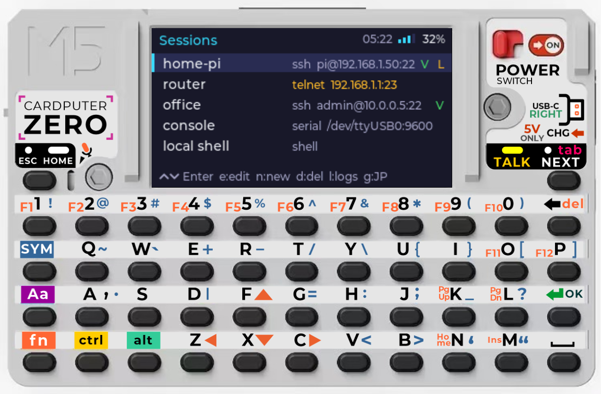

保存した接続先の一覧です。右端の **`V`=VPN付き** / **`L`=ログ保存ON**。proto は `ssh`(シアン)/`tel`(橙)/`serial`/`shell`。

| キー | 動作 |
|------|------|
| `↑↓` | 選択 |
| `Enter` | 接続（VPN付きなら先にVPNを張る） |
| `e` | 選択中を編集 |
| `n` | 新規作成 |
| `d` | 削除（確認あり） |
| `l` | ログ一覧へ |
| `g` | UI表示言語 EN ⇄ 日本語 を切替（保存） |

---

## 3. 接続先の作成・編集

`n`(新規) または `e`(編集) で編集画面に入ります。

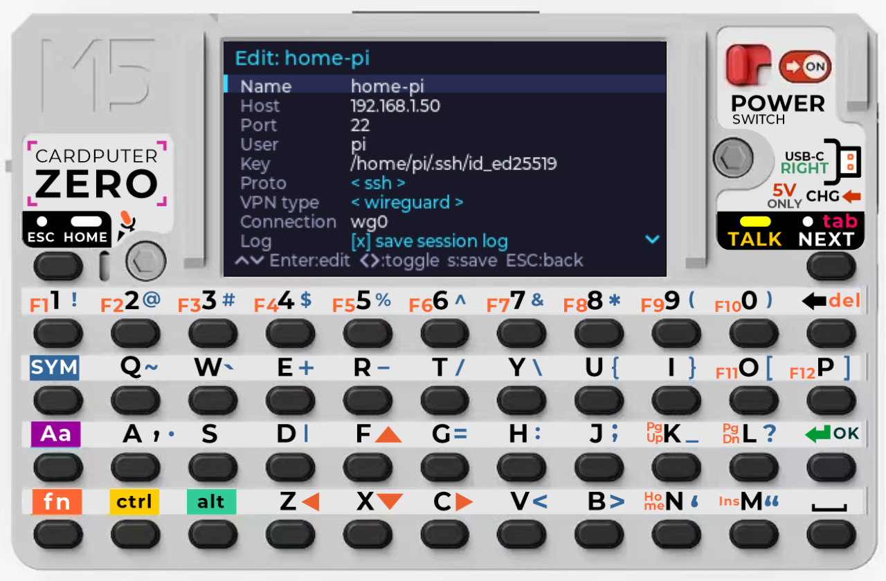

| 項目 | 内容 |
|------|------|
| Name | 表示名 |
| Host / Port / User | 接続先 |
| Key | SSH の**秘密鍵ファイル**のパス（任意、ssh 時のみ表示 → `-i` で使用。空なら既定鍵/パスワード） |
| Proto | `ssh / telnet / shell / serial`（`←→`で切替） |
| **VPN type** | `none / WireGuard / OpenVPN / IKEv2 / L2TP / Tailscale`（iPhone風に`←→`で選択） |
| **Connection** | OS側 VPN 接続の**名前**（NM接続名 / wg・ovpn の config名 / ipsec connection名）。**秘密情報は入力せず OS が保持**。Tailscale は不要 |
| Log | セッションログ保存 ON/OFF |
| Size | 端末フォント `12 / 16 / 20px` |

操作：`↑↓`項目移動 / `Enter`テキスト編集（物理キーボードで入力→`Enter`確定）/ `←→`選択項目の切替 / `s`保存 / `ESC`戻る。

> **serial（USB-シリアルコンソール）**：Proto を `serial` にすると項目が **Device**（例 `/dev/ttyUSB0`）・
> **Baud**（例 `9600`/`115200`）・**Format**（`8N1`/`7E1`/`7O1`/`8N2` を `←→` で選択）に変わります
> （User/VPN は非表示）。接続すると `picocom` でシリアルコンソールにつながります（実機に
> `apt install picocom` が必要）。網機器のコンソールポート接続用で、Session Menu の **Send BREAK** で
> BREAK 信号も送れます（ルータのパスワードリカバリ等）。
>
> ssh は **keep-alive を常時付与**（`ServerAliveInterval=30`）するため、回線断は約90秒以内に切断として検知されます。

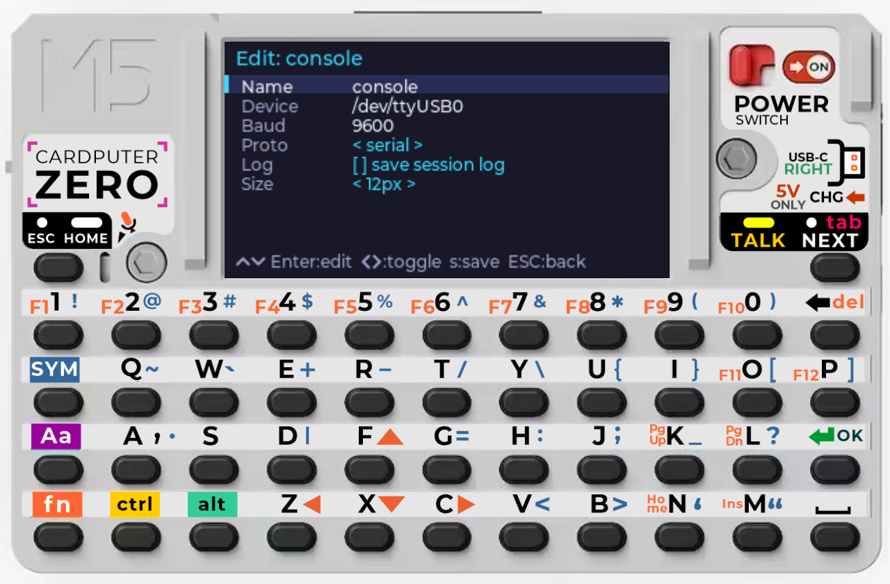

---

## 4. ターミナル（接続中）

接続すると端末画面になります。**すべてのキーが接続先へ送られます**（`ls`・`vim`・`htop` 等が動作、SGR色対応）。

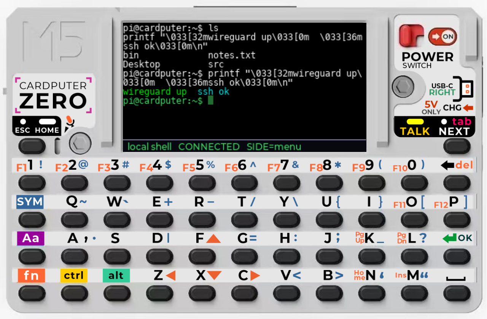

- 下部のステータスバー＝`接続先名 ● CONNECTED  VPN  ◉REC(ログ中)  SIDE=menu`。
- `ESC` は端末へ素通し（vim等で使用）。離脱・操作は **SIDEキー** で Session Menu を開きます。
- **スクロールバック**：`Alt+↑↓`で1行ずつ、`Alt+←→`で1画面ずつ過去の出力を遡って表示します（ライブのまま。履歴は最大400行）。何かキーを打つと自動で最新表示へ戻り、履歴表示中は下部にヒントを表示します。
- **F1〜F12 / Insert / PageUp / PageDown** はそのまま端末へ送られます（xterm互換エスケープ）。**`Alt+文字` は Meta**（ESCプレフィクス）として送出され、シェルの `M-b`/`M-f`（単語移動）や emacs 系の操作に使えます（`Alt+c`/`Alt+v` はコピー/貼り付けに割当て）。
- **行コピー＆貼り付け**：`Alt+c` でコピーモード（画面下にヒント表示）。`↑↓` でハイライト行を移動（最上段でさらに `↑` すると履歴へ）、`Enter` でその1行をコピー、`ESC` で取消。`Alt+v` で貼り付け（Enterは付かないので確認してから実行できます）。出力中の IP アドレスやコマンドの拾い直しに。切断画面でもコピーできます。

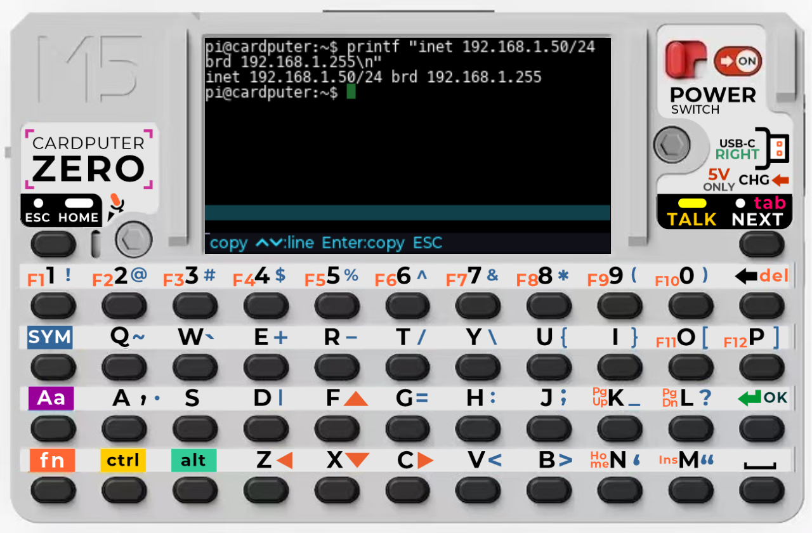

- 日本語・CJK を含む出力もそのまま表示されます（端末フォントに CJK フォントをfallback）。
- 切断・接続失敗するとステータスが赤の `● DISCONNECTED` になり、**最後の出力（エラー等）はそのまま残ります**。
  `Enter`（または `ESC`）で一覧へ戻り、`r` で同じ接続先へ**再接続**します（`Alt+矢印`で履歴も確認できます）。

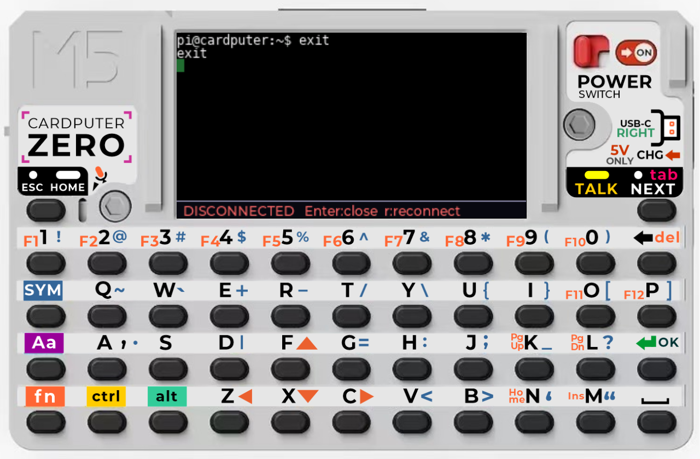

---

## 5. Session Menu（SIDEキー）

ターミナル中に **SIDEキー**（エミュは `Fn+Q`）で開きます。

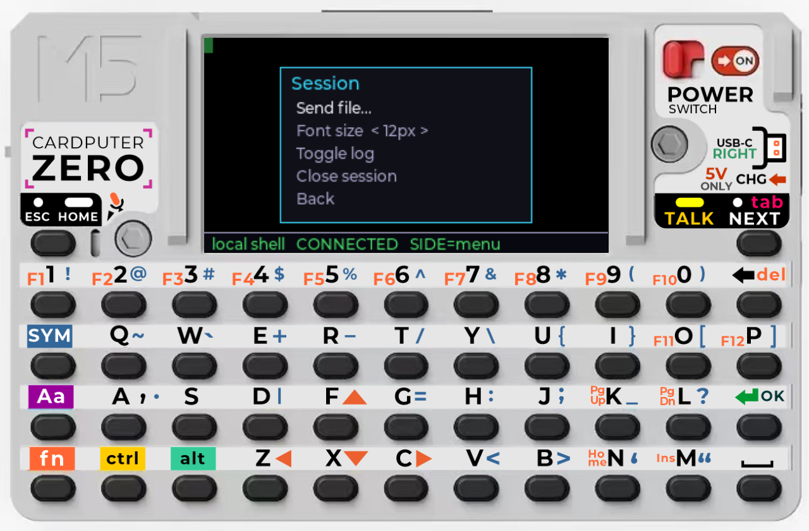

| 項目 | 動作 |
|------|------|
| Send file... | ファイル（設定/スクリプト/任意テキスト）を流し込む（→ 6章） |
| Font size `< 12px >` | フォントサイズを実行中に変更 |
| Macros... | 登録済みコマンドを選んで送信（→ 5b章） |
| Toggle log | ログ保存のON/OFF |
| Send BREAK | **BREAK信号を送出**（serial 接続時のみ表示。パスワードリカバリ等） |
| Close session | セッション終了→一覧へ |
| Back | メニューを閉じる |

`↑↓`移動 / `Enter`決定 / `ESC`または`SIDE`で閉じる。

---

## 5b. マクロ（よく使うコマンドの送信）

よく使う1行コマンド（`show running-config`、`df -h` 等）を登録しておき、Session Menu →「Macros...」から
選んで**そのまま実行**できます（本文＋Enter が端末へ送られます）。

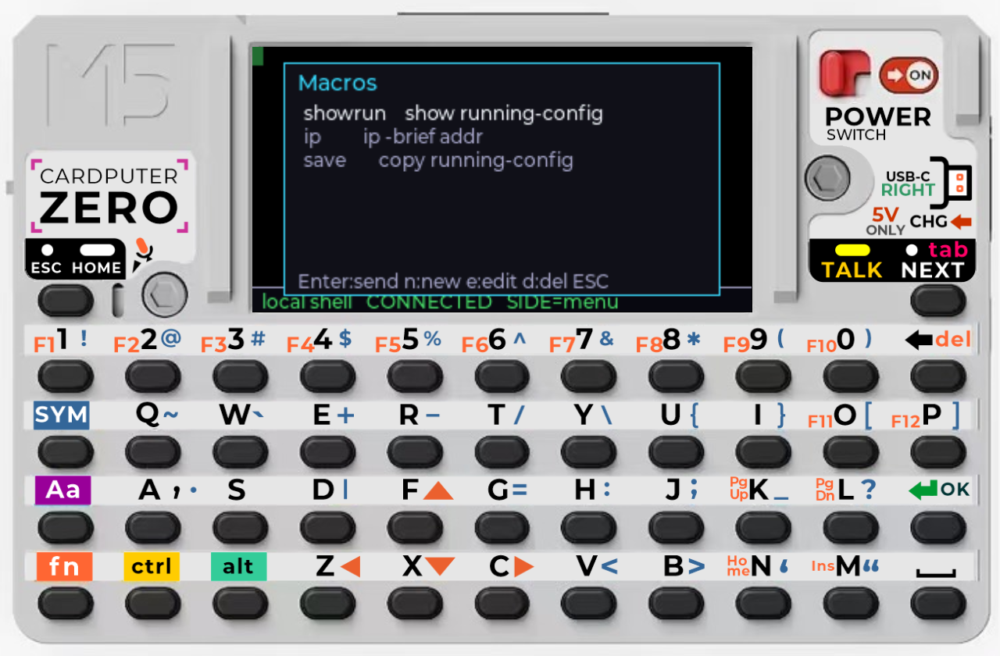

| キー | 動作 |
|------|------|
| `↑↓` | 選択 |
| `Enter` | 選択中のマクロを送信（実行） |
| `n` | 新規登録（名前＋コマンドを編集） |
| `e` | 選択中を編集 |
| `d` | 選択中を削除 |
| `ESC` | 閉じる |

編集画面は `↑↓`で Name/Text 切替、`Enter`で入力開始→`Enter`確定、`ESC`で完了（**自動保存**。
Text が空のマクロは破棄されます）。マクロは接続先によらず共通で、`term.conf` に保存されます（最大12件）。

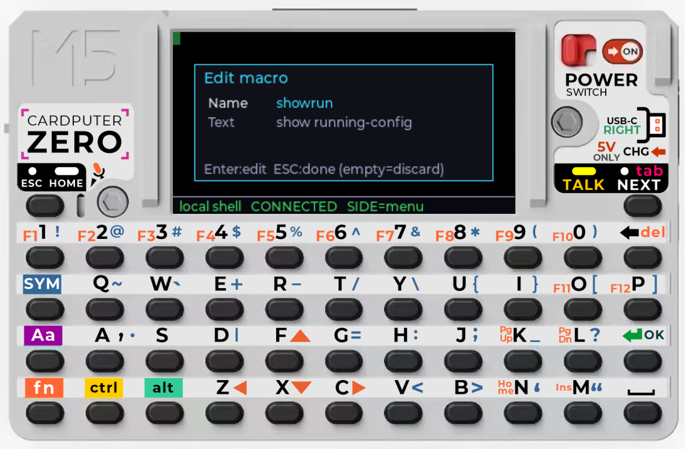

---

## 6. ファイルの流し込み（文字コード自動認識）

ローカルのテキストファイル（機器設定・スクリプト・コマンド列・メモ等、**設定ファイルに限りません**）を、
端末にそのまま打ち込んだように送出します。Session Menu →「Send file」でファイルを選びます。

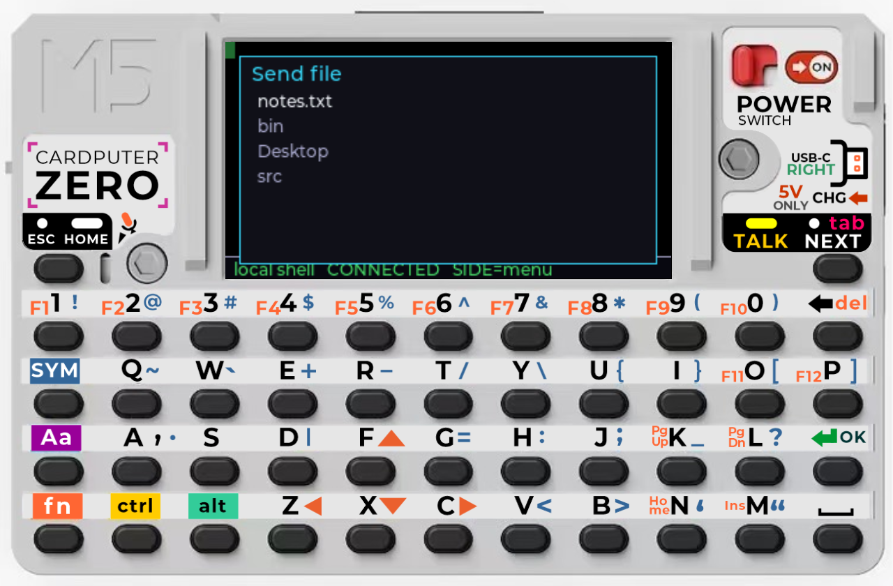

ファイルを選ぶと **送出ダイアログ** が出ます。


- **Detected**：文字コードを自動判定（例 `Shift_JIS`）。
- **Send as**：`UTF-8` へ自動変換して送出（SJIS/EUC/raw も可）。
- `Enter`で送出開始（行ごとにペース送出。網機器のCLIへ設定を流す、スクリプトを貼る 等）。`ESC`で取消。

---

## 7. ログ

接続先で Log=ON にすると、セッションが `/sdcard/logs/<名前>-<日時>.log` に保存されます。

一覧（`l`キー）：

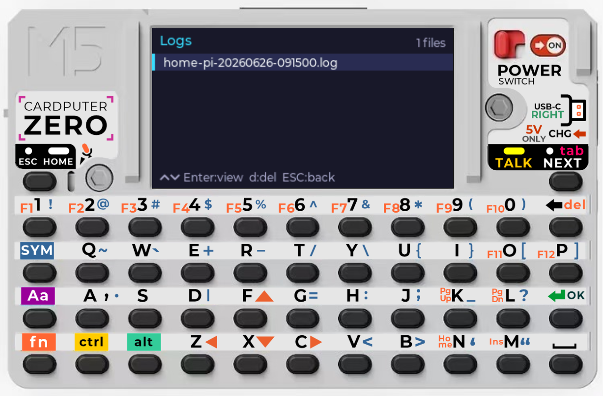

`Enter`で閲覧（ANSI除去・`↑↓`スクロール、`d`削除、`ESC`戻る）：

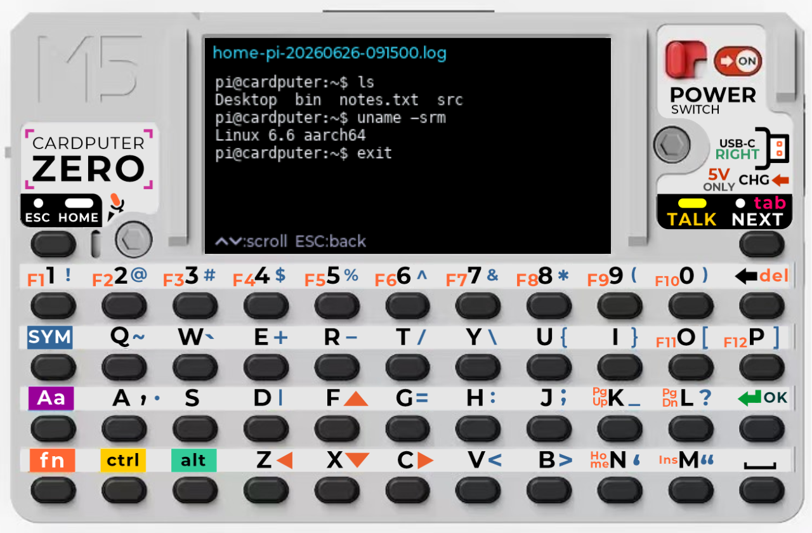

---

## 8. プロファイルの削除

一覧で `d` を押すと確認ダイアログが出ます（`←→`選択、`Enter`決定、`ESC`取消）。

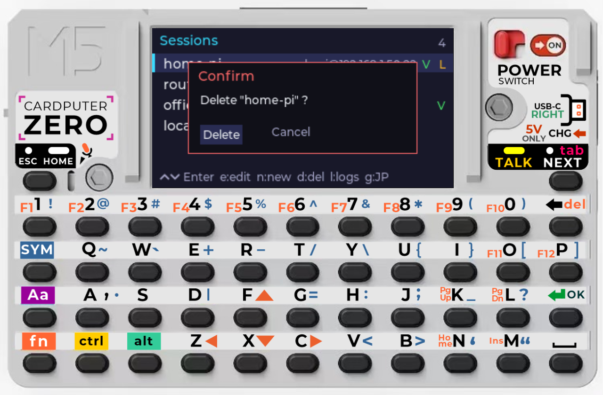

VPN起動に失敗した時も同様のダイアログで「Connect anyway（このまま接続）/ Cancel」を選べます。

---

## 9. 日本語入力

**他のアプリと同じく、OS の日本語IME（fcitx5-mozc）で入力します**（アプリ独自のIMEは持ちません）。

- 実機: Wayland で `fcitx5-mozc` を有効化（`GTK_IM_MODULE=fcitx` 等）。
- **ON/OFF はシステムのIMEトグル**（既定 **Ctrl+Space**）。全アプリ共通の操作です。
- 変換・確定した漢字かな交じり文がそのまま端末へ入ります（候補窓は fcitx5 が表示）。

> UI表示言語（メニュー等の英／日）は別機能です。接続先一覧で `g` キーで EN⇄JA を切替（設定は保存されます）。

---

## 10. フォントサイズ変更

- プロファイルの **Size**（12/16/20px）で既定を指定。
- 接続中は Session Menu の **Font size** で即時切替（桁数・行数が変わります）。

### 文字サイズ比較（同じ表示内容）

**12px** — 45桁×12行（情報量重視）
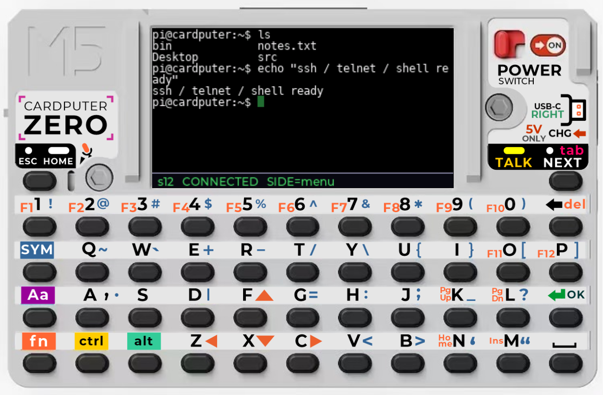

**16px** — 約34桁×9行（標準）
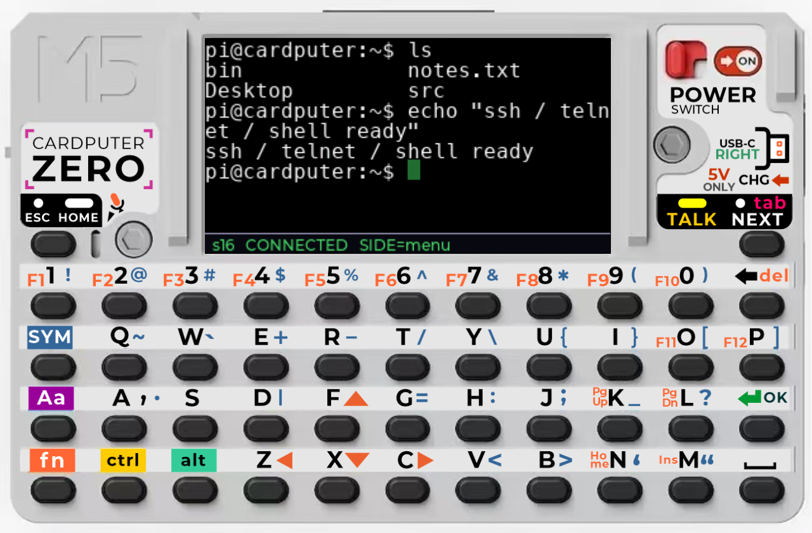

**20px** — 約27桁×7行（大きく読みやすい。屋外・視認性重視）
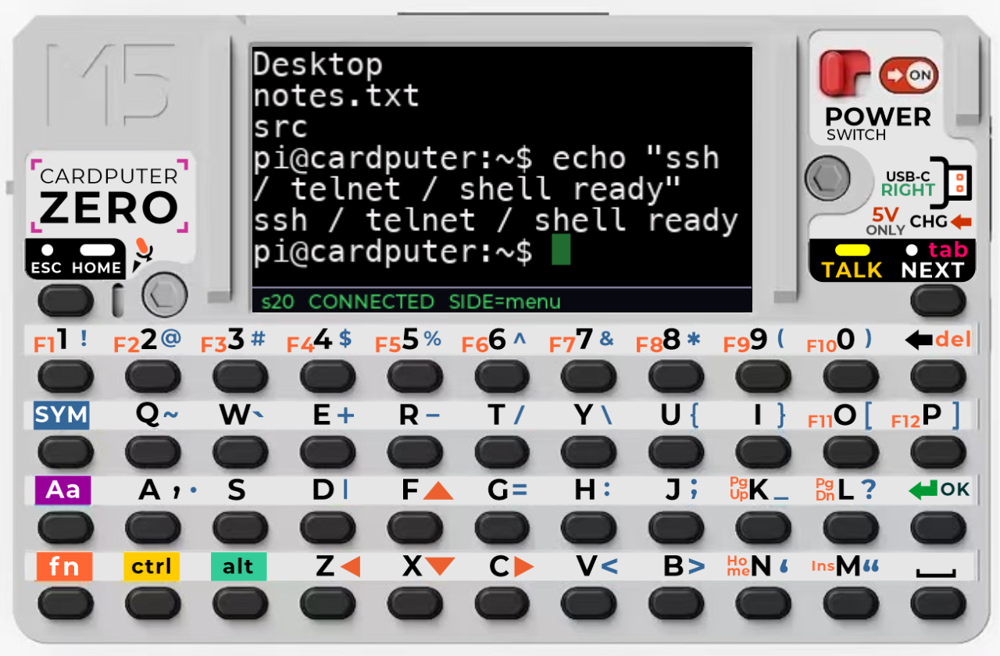

小さいほど一度に多く表示でき、大きいほど読みやすくなります（桁数が減ると長い行は折り返されます）。

---

## 10b. 表示言語（EN / 日本語 UI）

接続先一覧で `g` キーを押すと、UI 表示（メニュー・項目名・キーガイド等）を **英語 ⇄ 日本語** で
切り替えます（`term.conf` に保存）。日本語はデバイス常駐の CJK フォントで描画され、ベースラインを
合わせて英語レイアウトと縦位置が揃います。上下左右の操作は **↑↓←→** で示します。
※これは表示言語の切替で、文字入力の日本語IME（OS の fcitx5）とは別です。

**接続先一覧（English / 日本語）**
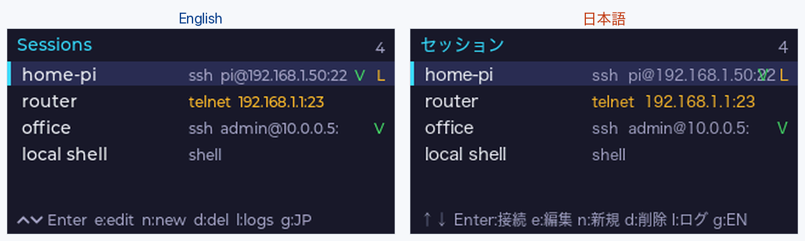

**プロファイル編集（English / 日本語）**
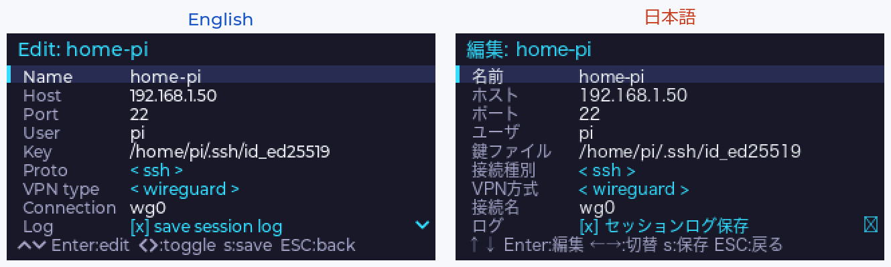

**Session Menu（English / 日本語）**
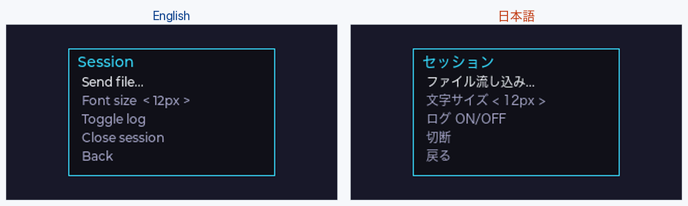

---

## 11. VPN

VPN は **OS 側の設定を利用します**（鍵・パスワード等の秘密情報は**アプリに保存しません**）。あらかじめ OS 側に
VPN 接続を作成しておき（NetworkManager の接続、`/etc/wireguard/*.conf` 等）、接続先の **VPN type** で方式を選び、
**Connection（接続名）** にその名前を入れるだけです。接続時に自動でVPNを張ってから接続、セッション終了で切断
（自分で張った時のみ）。

- **NetworkManager がある場合**（Raspberry Pi OS Bookworm の既定）：`pkexec nmcli connection up <接続名>` の
  1コマンドで全方式を起動（終了は down）。
- 無い場合は方式ごとに fallback：

| 方式 | 起動コマンド（接続名を渡すだけ） |
|------|------|
| WireGuard | `wg-quick up <名>` |
| OpenVPN | `openvpn --config <名> --daemon` |
| IKEv2 | `ipsec up <名>`（strongSwan） |
| L2TP | `xl2tpd-control connect <名>` |
| Tailscale | `tailscale up`（認証は事前に済ませておく） |

root起動のため実機側に各ツールと **polkit/pkexec の許可**が必要です（無人起動の polkit ルール例は
`docs/DEVICE_CHECKLIST.md`）。

---

## 12. ファイルの場所
| 種類 | 既定パス | 環境変数 |
|------|------|------|
| プロファイル設定 | `/sdcard/term.conf` | `TERM_CONF` |
| セッションログ | `/sdcard/logs/` | `TERM_LOGDIR` |
| 流し込み元ディレクトリ | `$HOME`（無ければ `/sdcard`） | `TERM_FILEDIR` |

---

## 13. ビルド・配備（開発者向け）
```sh
# Mac（エミュレータ、対話）
cd ~/Projects/cardputerzero-ssh-term && ./build-emu.sh --run

# 実機（M5CardputerZero, arm64）
~/cardputer-zero/czpi/build.sh ~/Projects/cardputerzero-ssh-term
~/cardputer-zero/czpi/deploy-run.sh ssh_term --host pi@<IP>
```
実機ランタイム依存：`libvterm0 openssh-client telnet`（任意 `wireguard-tools openvpn fcitx5-mozc`）。
詳細な実機検証手順は `docs/DEVICE_CHECKLIST.md`、機能一覧は `docs/FEATURES.md`。
