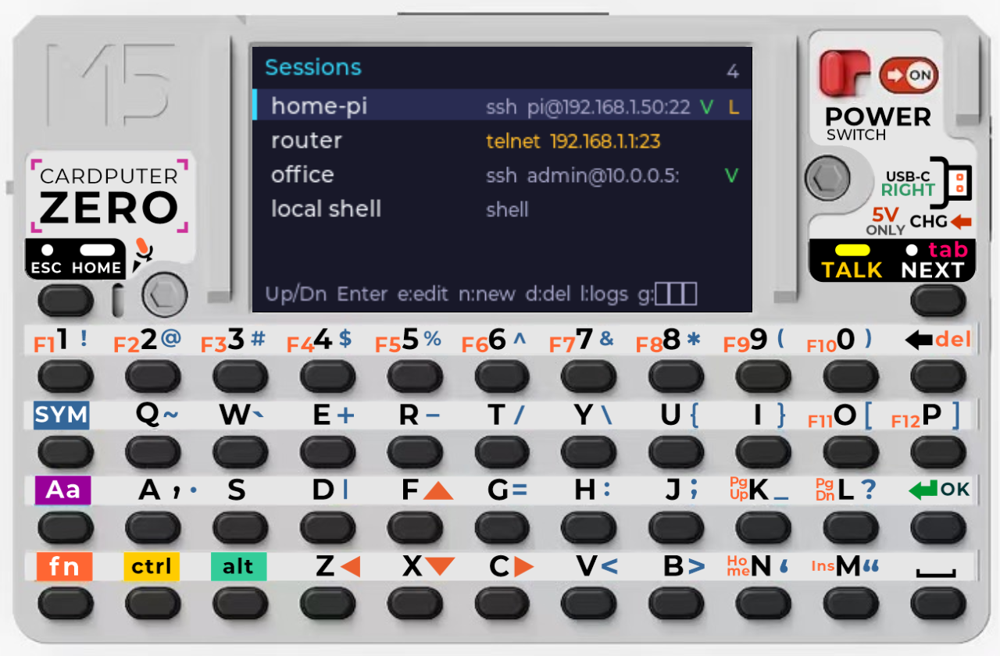
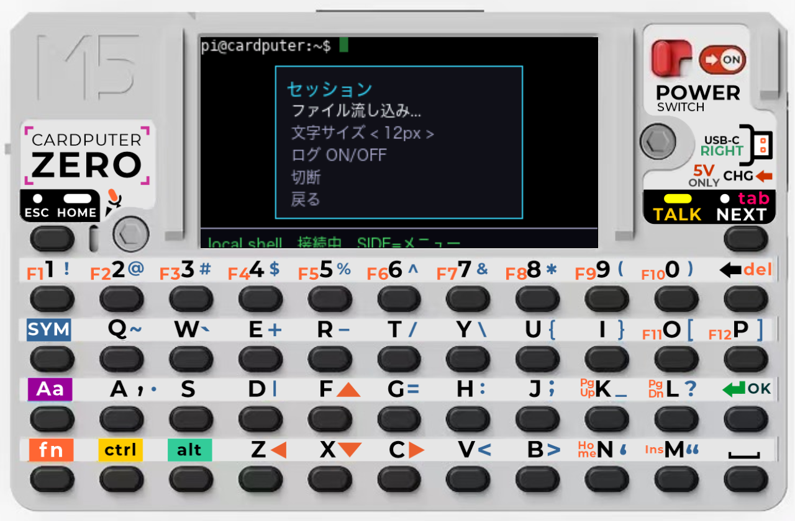

# ssh_term 取扱説明書

**M5CardputerZero**（AArch64 Linux / Raspberry Pi OS, 320×170）用の **SSH / telnet / ローカルシェル** 端末です。
接続先プロファイル・VPN・セッションログ・**ファイル流し込み**（任意のテキストを文字コード自動認識して送出）・
日本語入力・フォントサイズ変更に対応します。

> 画面は本体スキン付きエミュレータの画面（アカウント情報はマスク）。

---

## 1. 起動と画面構成

起動すると **接続先一覧（Sessions）** が表示されます。基本操作は全画面共通です。

| キー | 動作 |
|------|------|
| `↑ / ↓` | 項目の移動 |
| `Enter` | 決定 |
| `ESC` | 戻る（ターミナル中は端末へ送信） |
| **SIDEキー** | ターミナル中に Session Menu を開く（エミュは `Fn+Q`） |

---

## 2. 接続先一覧（Sessions）


保存した接続先の一覧です。右端の **`V`=VPN付き** / **`L`=ログ保存ON**。proto は `ssh`(シアン)/`tel`(橙)/`shell`。

| キー | 動作 |
|------|------|
| `↑↓` | 選択 |
| `Enter` | 接続（VPN付きなら先にVPNを張る） |
| `e` | 選択中を編集 |
| `n` | 新規作成 |
| `d` | 削除（確認あり） |
| `l` | ログ一覧へ |
| `g` | UI表示言語 EN ⇄ 日本語 を切替（保存） |

---

## 3. 接続先の作成・編集

`n`(新規) または `e`(編集) で編集画面に入ります。


| 項目 | 内容 |
|------|------|
| Name | 表示名 |
| Host / Port / User | 接続先 |
| Proto | `ssh / telnet / shell`（`←→`で切替） |
| **VPN type** | `none / WireGuard / OpenVPN / IKEv2 / L2TP / Tailscale`（iPhone風に`←→`で選択） |
| VPN cfg | VPN設定名/パス（wg/ovpnのconfig名、ipsecのconnection名 等） |
| Log | セッションログ保存 ON/OFF |
| Size | 端末フォント `12 / 16 / 20px` |

操作：`↑↓`項目移動 / `Enter`テキスト編集（物理キーボードで入力→`Enter`確定）/ `←→`選択項目の切替 / `s`保存 / `ESC`戻る。

---

## 4. ターミナル（接続中）

接続すると端末画面になります。**すべてのキーが接続先へ送られます**（`ls`・`vim`・`htop` 等が動作、SGR色対応）。


- 下部のステータスバー＝`接続先名 ● CONNECTED  VPN  ◉REC(ログ中)  SIDE=menu`。
- `ESC` は端末へ素通し（vim等で使用）。離脱・操作は **SIDEキー** で Session Menu を開きます。
- 切断するとステータスが `● DISCONNECTED` になり、`Enter`で一覧へ戻ります。

---

## 5. Session Menu（SIDEキー）

ターミナル中に **SIDEキー**（エミュは `Fn+Q`）で開きます。


| 項目 | 動作 |
|------|------|
| Send file... | ファイル（設定/スクリプト/任意テキスト）を流し込む（→ 6章） |
| Font size `< 12px >` | フォントサイズを実行中に変更 |
| Toggle log | ログ保存のON/OFF |
| Close session | セッション終了→一覧へ |
| Back | メニューを閉じる |

`↑↓`移動 / `Enter`決定 / `ESC`または`SIDE`で閉じる。

---

## 6. ファイルの流し込み（文字コード自動認識）

ローカルのテキストファイル（機器設定・スクリプト・コマンド列・メモ等、**設定ファイルに限りません**）を、
端末にそのまま打ち込んだように送出します。Session Menu →「Send file」でファイルを選びます。


ファイルを選ぶと **送出ダイアログ** が出ます。


- **Detected**：文字コードを自動判定（例 `Shift_JIS`）。
- **Send as**：`UTF-8` へ自動変換して送出（SJIS/EUC/raw も可）。
- `Enter`で送出開始（行ごとにペース送出。網機器のCLIへ設定を流す、スクリプトを貼る 等）。`ESC`で取消。

---

## 7. ログ

接続先で Log=ON にすると、セッションが `/sdcard/logs/<名前>-<日時>.log` に保存されます。

一覧（`l`キー）：


`Enter`で閲覧（ANSI除去・`↑↓`スクロール、`d`削除、`ESC`戻る）：


---

## 8. プロファイルの削除

一覧で `d` を押すと確認ダイアログが出ます（`←→`選択、`Enter`決定、`ESC`取消）。


VPN起動に失敗した時も同様のダイアログで「Connect anyway（このまま接続）/ Cancel」を選べます。

---

## 9. 日本語入力

**他のアプリと同じく、OS の日本語IME（fcitx5-mozc）で入力します**（アプリ独自のIMEは持ちません）。

- 実機: Wayland で `fcitx5-mozc` を有効化（`GTK_IM_MODULE=fcitx` 等）。
- **ON/OFF はシステムのIMEトグル**（既定 **Ctrl+Space**）。全アプリ共通の操作です。
- 変換・確定した漢字かな交じり文がそのまま端末へ入ります（候補窓は fcitx5 が表示）。

> UI表示言語（メニュー等の英／日）は別機能です。接続先一覧で `g` キーで EN⇄JA を切替（設定は保存されます）。

---

## 10. フォントサイズ変更

- プロファイルの **Size**（12/16/20px）で既定を指定。
- 接続中は Session Menu の **Font size** で即時切替（桁数・行数が変わります）。

### 文字サイズ比較（同じ表示内容）

**12px** — 45桁×12行（情報量重視）


**16px** — 約34桁×9行（標準）


**20px** — 約27桁×7行（大きく読みやすい。屋外・視認性重視）


小さいほど一度に多く表示でき、大きいほど読みやすくなります（桁数が減ると長い行は折り返されます）。

---

## 10b. 表示言語（EN / 日本語 UI）

接続先一覧で `g` キーを押すと、UI 表示（メニュー・項目名・キーガイド等）を **英語 ⇄ 日本語** で
切り替えます（`term.conf` に保存）。日本語はデバイス常駐の CJK フォントで描画されます。
※これは表示言語の切替で、文字入力の日本語IME（OS の fcitx5）とは別です。

**接続先一覧（日本語）**


**プロファイル編集（日本語）**


**Session Menu（日本語）**


---

## 11. VPN

接続先の **VPN type** で方式を選び、**VPN cfg** に設定名を入れます。接続時に自動でVPNを張ってから接続、
セッション終了で切断（自分で張った時のみ）。方式ごとに以下を `pkexec` で実行します（実機）。

| 方式 | 起動コマンド |
|------|------|
| WireGuard | `wg-quick up <cfg>` |
| OpenVPN | `openvpn --config <cfg> --daemon` |
| IKEv2 | `ipsec up <cfg>`（strongSwan） |
| L2TP | `xl2tpd-control connect <cfg>` |
| Tailscale | `tailscale up` |

実機側に各ツール（`wireguard-tools` 等）と polkit/pkexec の許可が必要です。

---

## 12. ファイルの場所
| 種類 | 既定パス | 環境変数 |
|------|------|------|
| プロファイル設定 | `/sdcard/term.conf` | `TERM_CONF` |
| セッションログ | `/sdcard/logs/` | `TERM_LOGDIR` |
| 流し込み元ディレクトリ | `$HOME`（無ければ `/sdcard`） | `TERM_FILEDIR` |

---

## 13. ビルド・配備（開発者向け）
```sh
# Mac（エミュレータ、対話）
cd ~/Projects/cardputerzero-ssh-term && ./build-emu.sh --run

# 実機（M5CardputerZero, arm64）
~/cardputer-zero/czpi/build.sh ~/Projects/cardputerzero-ssh-term
~/cardputer-zero/czpi/deploy-run.sh ssh_term --host pi@<IP>
```
実機ランタイム依存：`libvterm0 openssh-client telnet`（任意 `wireguard-tools openvpn fcitx5-mozc`）。
詳細な実機検証手順は `docs/DEVICE_CHECKLIST.md`、機能一覧は `docs/FEATURES.md`。
